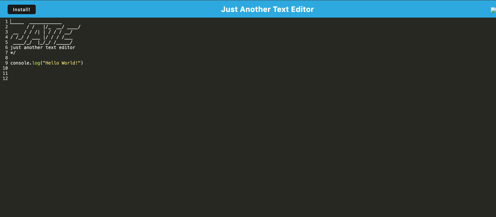

# Just Another Text Editor (J.A.T.E.)

## Description

Just Another Text Editor (J.A.T.E.) is a Progressive Web Application (PWA) that allows users to create, edit, and save text or code snippets. It is designed to work offline, ensuring that users can reliably retrieve their notes and code snippets even without an internet connection. The application uses IndexedDB for data persistence and is fully functional as a standalone application when installed on the user's device.

## Table of Contents

1. [Installation](#installation)
2. [Usage](#usage)
3. [Features](#features)
4. [Technologies](#technologies)
5. [Screenshots](#screenshots)
6. [Questions](#questions)
7. [Live Application](#live-application)

## Installation:

1. **Clone the Repository**:
    ```bash
    git clone https://github.com/markjas0n/text-ediquette.git
2. **Navigate to the project directory**:
    ```bash
    cd text-ediquette
3. **Install the dependencies**:
    ```bash
    npm install
4. **Build the application**:
    ```bash
    npm run build
5. **Start the application**:
    ```bash
    npm start
4. The application will run on http://localhost:3000.

## Usage

1. Open the Application:
2. Navigate to http://localhost:3000 in your web browser.
3. Editing Text:
    - You can start typing or editing the text/code in the text editor. The content will be automatically saved to IndexedDB when the editor loses focus.
4. Offline Mode:
    - The application is designed to work offline. If you lose internet connectivity, you can still edit and save your text, and it will sync when the connection is restored.
5. Installation:
    - Click on the "Install" button to install J.A.T.E. as a standalone application on your device.

## Features

- Progressive Web Application (PWA): J.A.T.E. can be installed on your device and works offline.
- IndexedDB: Data is stored in IndexedDB, providing robust and persistent storage across sessions.
- CodeMirror Integration: A rich text editor with syntax highlighting for code snippets.
- Service Worker: Uses a service worker to cache assets and ensure the application loads quickly and works offline.
- Responsive Design: Works seamlessly across devices of various sizes.

## Technologies

- JavaScript
- Node.js
- Express.js
- Webpack
- Babel
- IndexedDB (via idb package)
- CodeMirror
- Workbox (for service worker)
- WebpackPwaManifest

## Screenshots


## Live Application
click ☞ [here](https://text-ediquette.onrender.com/)